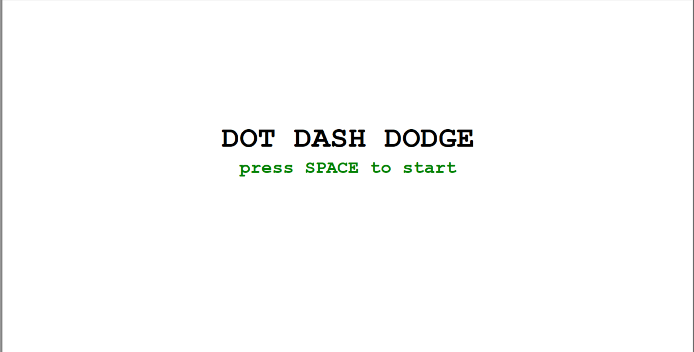
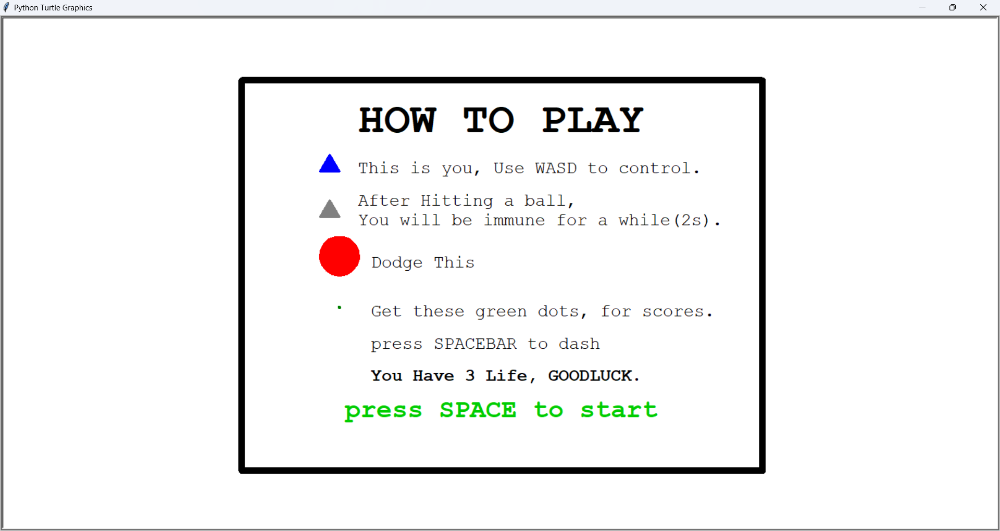
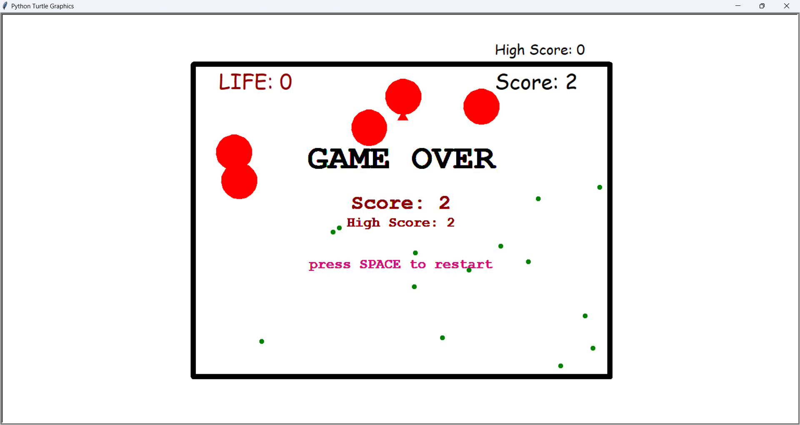
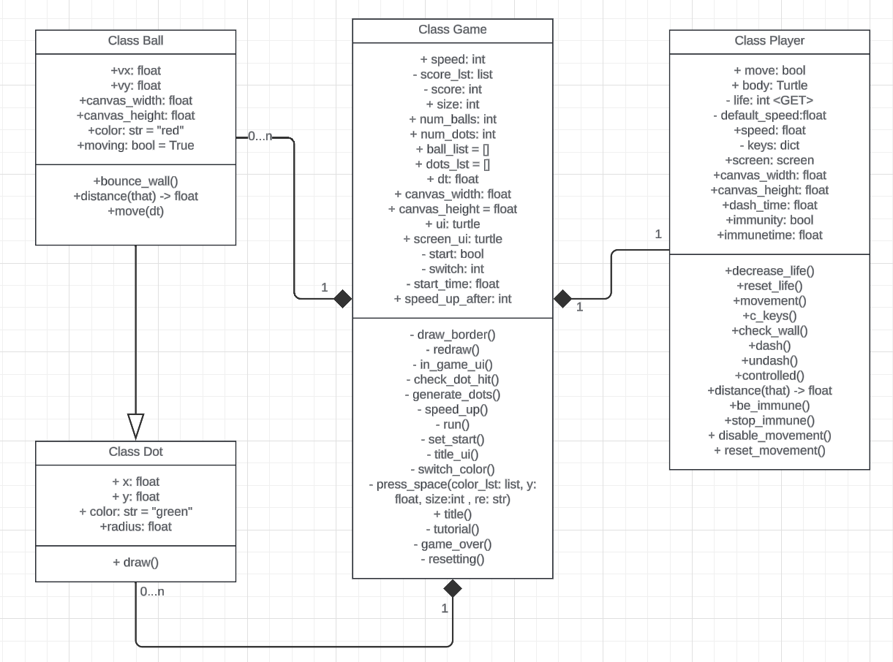

# DOT DODGE DASH: Dodging ball while eating dots game

## What is This About?
In this game, player is able to control the **blue triangle** and try to dodge the red ball that bouncing around while collecting dots to earn a score
- Player is able to **move** freely using WASD
- Player can **dash** by pressing space bar key
- Player can **play again** and see their highest score

## Set up
- First, download all the file. Then, open run.py file and just run the program
  - SUGGESTION: using IDE to run the game will make the game smoother (Pycharm should be better)
- If the ball or the player feel so slow, user can adjust the speed by an instruction in the file run.py
- The tutorial is given in game

## Usage
- When First run code, User will see the Title screen
  
- When user press SPACE, They will see the instruction
  
- The user can control player and move around freely using WASD, and space bar as dash
  , VDO: https://youtu.be/o2cmxuTKfRo
- When the player hit red balls, They will lose life and be immune for 2 second
  , VDO: https://youtu.be/_0NPk_BuHqs
- When the player lose their last life, they die, game over and can choose to play again
  
  - The High score will be recode as long as user does not close the game

## Project design and implementation
UML CLASS:
  
- ### Purpose of each class:
  - **Class Ball**: represent everything about red balls, movement and information
  - **Class Dot**: for creating and collect data(position) of dots
  - **Class Player**: represent everything about player; life, movement, status, distance checking.
  - **Class Game**: This class is for connect everything together and making UI
- ### Interaction of each class:
  - When the distance between Ball and Player are less than ball's radius (they collide) and player size, player's life decrease
  - When the distance between dots and Player are less than player size(they hit), dot is destroyed and score increased
  - Class Dot is the parent of class Ball, share same function (draw)

- ### Extension/Modification form base code:
  - All the Player class, player movement and body:
    - Mix with the code for the interactivity, trigger the function that trigger the boolean that will make player move
  - The UI: use turtle write()
  - The consequence when two objects touch each others
    - check when the distance of 2 things are close(base code) and make the result base on the objects and status of objects

- ### Bugs
  - There still some weird frame loading when running through cmd (but mine work now) or some computer, but in most computer(3/4) they work.
    [Blinking_bug.mp4](Pic_and_Vid/Blinking_bug.mp4)
    - VDO: https://youtu.be/_nSv2oZEvT8
  - If you press space as soon as you die in any reasons(you might want to dash but fail), the game will automatically start a new game.
  - _others are working normally_

## Rate my project: 95
- 95: there is a lot of the room to improve and adding new feature. Anyway, in this amount of time with final weeks, I think this is pretty impressive.